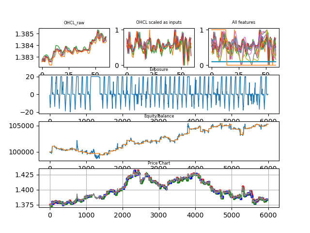

### gym-fx

gym forex environment for testing with mt4 support (work in progress)

## Installation

```python
git clone https://github.com/XJacek/gym-fx.git
cd gym-fx/
pip install .

import gym_fx
```

## Data preparation
```python
import pandas as pd
url = 'https://raw.githubusercontent.com/XJacek/gym-fx/master/data/EURUSD_M5.csv'
train_df = pd.read_csv(url, sep = ',' )
```

## Environment usage
```python
import gym
import gym_fx
env = gym.make('fx-v0',df= train_df, lookback=60,
                                              initial_balance=100000,
                                              units=10000, leverage = 500, commission=5, spread=1,
                                              ticks=False,  mt4 = False,
                                              act_space='discrete', obs_space ='box',
                                              log = True, diff=True)
                                              
```
